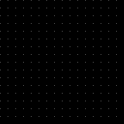
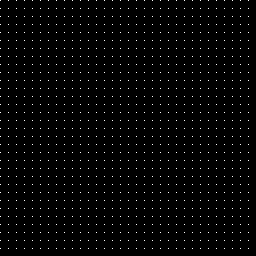
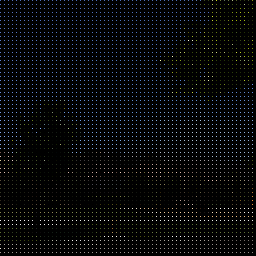
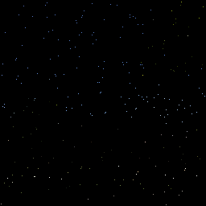
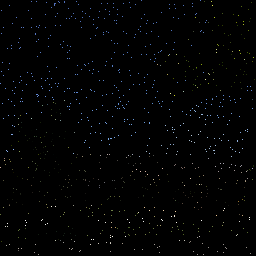
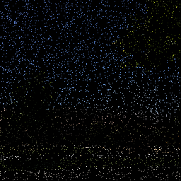
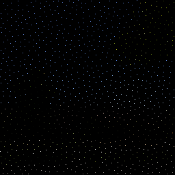
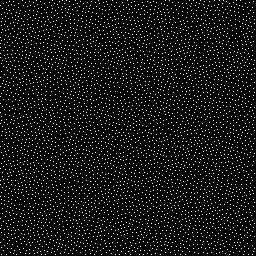

<!-- START doctoc generated TOC please keep comment here to allow auto update -->
<!-- DON'T EDIT THIS SECTION, INSTEAD RE-RUN doctoc TO UPDATE -->
**Table of Contents**  *generated with [DocToc](https://github.com/thlorenz/doctoc)*

- [Generating Blue Noise Sample Points With Mitchell’s Best Candidate Algorithm](#generating-blue-noise-sample-points-with-mitchells-best-candidate-algorithm)
  - [Regular sampling](#regular-sampling)
  - [White Noise Sampling](#white-noise-sampling)
  - [Blue Noise Sampling](#blue-noise-sampling)

<!-- END doctoc generated TOC please keep comment here to allow auto update -->

# Generating Blue Noise Sample Points With Mitchell’s Best Candidate Algorithm

Different sampling patterns, to fill a sample space. are used in this example
(regular sampling, white nose and blue noise)

## Regular sampling

Regular sampling consists of evenly spacing the points, this strategy may
contain aliasing, but there is good coverage of the sample space.

Here are 256, 1024 and 4096 samples:

## White Noise Sampling

White noise sampling just chooses random numbers for where to place the sample.

The random numbers are uniformly distributed, each number has the same
probability to come up.
White noise sampling can produce noisy results, sample points can clump
together and generate empty spaces. In general, noise is often desired over
aliasing though, so white noise samples are generally preferred over regular
sampling.

Here are 256, 1024 and 4096 samples:

## Blue Noise Sampling

Finally there is the blue noise sampling that is between the regular sampling
and the blue noise sampling. Blue noise sampling places random points like
white noise sampling, but the points are approximately the same distance apart.

Here are 256, 1024 and 4096 samples:

