<!-- START doctoc generated TOC please keep comment here to allow auto update -->
<!-- DON'T EDIT THIS SECTION, INSTEAD RE-RUN doctoc TO UPDATE -->
**Table of Contents**  *generated with [DocToc](https://github.com/thlorenz/doctoc)*

- [Generate Blue Noise Sample Points Using Best Candidate Mitchell Algorithm](#generate-blue-noise-sample-points-using-best-candidate-mitchell-algorithm)
  - [Regular sampling](#regular-sampling)
  - [White Noise Sampling](#white-noise-sampling)
  - [Blue Noise Sampling](#blue-noise-sampling)
- [Comparison](#comparison)

<!-- END doctoc generated TOC please keep comment here to allow auto update -->

# Generate Blue Noise Sample Points Using Best Candidate Mitchell Algorithm

Different sampling patterns, to fill a sample space. Are used in this example
(regular sampling, white nose and blue noise)

## Regular sampling

Regular sampling consists of evenly spacing the points, taken regular intervals
based on the number of samples and the image size, this strategy may contain
aliasing, but there is good coverage of the sample space, though less reliable
in certain circumstances than random sampling, systematic sampling may be
more practicable and more economical in the time it takes.

Here are 256, 1024 and 4096 samples:

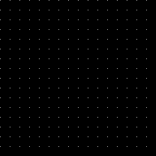

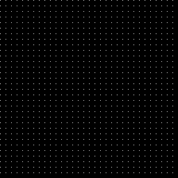

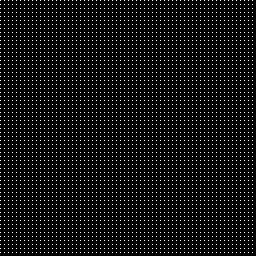

Here are those samples taken from a source image:

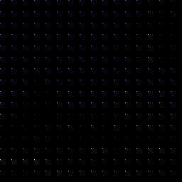

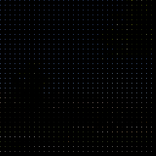

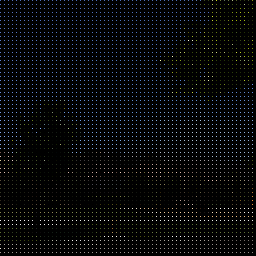

## White Noise Sampling

White noise sampling just chooses random numbers for where to place the sample.

The random numbers are uniformly distributed, each number has the same
probability to come up.
White noise sampling can produce noisy results, sample points can clump
together and generate empty spaces. In general, noise is often desired over
aliasing though, so white noise samples are generally preferred over regular
sampling.

Here are 256, 1024 and 4096 samples:

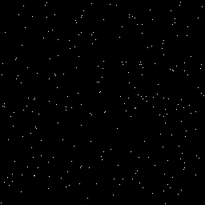

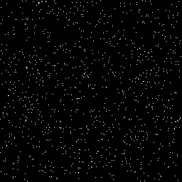

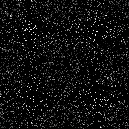

Here are those samples taken from a source image:

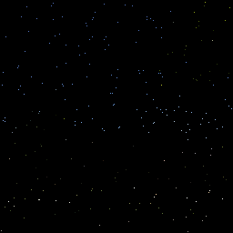

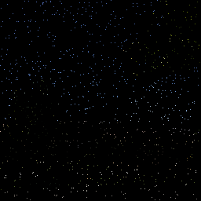

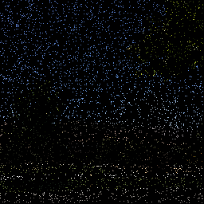

## Blue Noise Sampling

Finally there is the blue noise sampling that is between the regular sampling
and the blue noise sampling. Blue noise sampling places random points like
white noise sampling, but the points are approximately the same distance apart.

Here are 256, 1024 and 4096 samples:

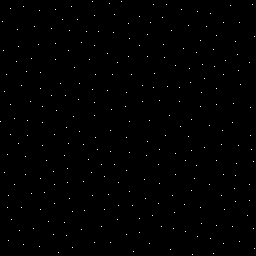

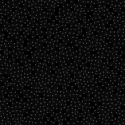

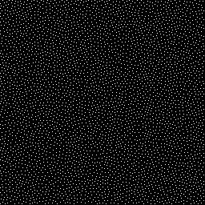

Here are those samples taken from a source image:

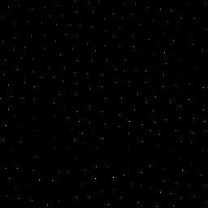

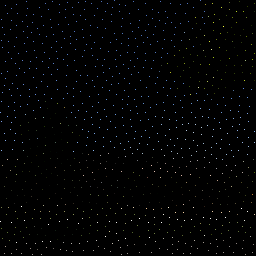

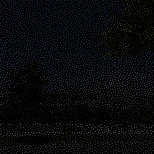

# Comparison

Imagine you were a robot with 4096 light/color sensors. Which of the following
images provides a better picture of reality?.

The best versions are regular sampling and blue noise, white noise presents
a very distorted picture of reality .

Regular sampling shows things better in a straight line (street, sidewalk),
but non-rectangular shaped things look like Minecraft blocks. The blue noise
grid does the reverse and makes straight things look wavy, while making it
easier to see the true shape of non straight things.

Here is the real image:

Obviously, the photoreceptors in our eyes are located in the form of blue
noise. Some say this is why blue noise is more consistent with our perception,
but also because numerical integration helps converge faster on fewer samples
(more samples wins versus white noise! ). That's what gives them an
evolutionary advantage  in the first place.
